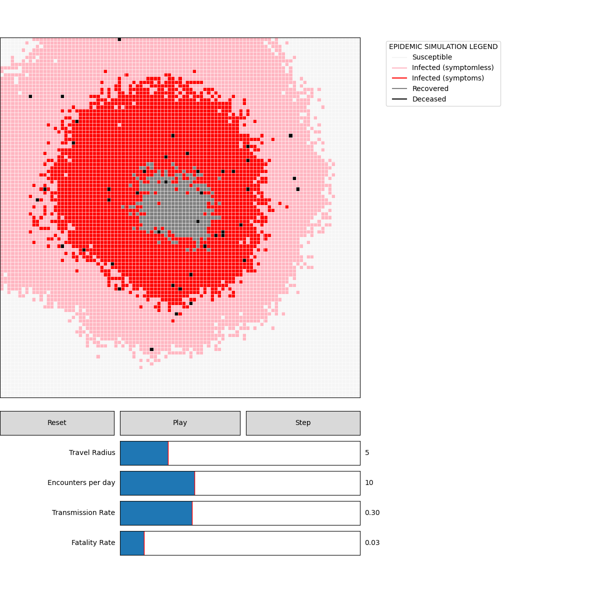

# Epidemic Simulator

An epidemic simulator written in Python. The user has the ability to change the travel radius, encounters per day, transmission rate, and fatality rate for each given time step. The simulator can also be played till all cells are infected or paused at any given time step.

### Legend

- **Susceptible** - Prone to infection.
- **Infected (symptomless)** - Infected with no symptoms.
- **Infected (symptoms)** - 7 days after infection with no symptoms (incubation period).
- **Recovered** - Survives infection.
- **Deceased** - Does not survive infection.

### Sliders

- **Travel Radius** - The range at which an infected will visit in a radius.
- **Encounters Per Day** - The number of cells an infected will visit.
- **Transmission Rate** - The proportion at which an infected will infect a susceptible.
- **Fatality Rate** - The proportion of infected that will become deceased.

## Getting Started

### Prerequisites

- Python 3.3+
- Jupyter

### Installing

Download the .ipynb file and simply run all cells in the Jupyter Notebook.

You will then have an interactive GUI of the simulator.

## Acknowledgments

- Inspired by Kevin Simler's Outbreak which is written in Javascript.